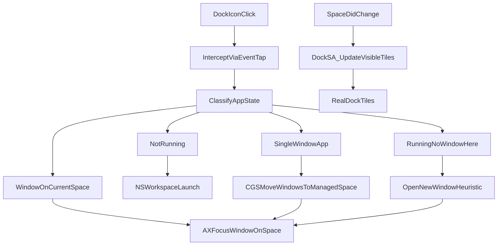

# macOS Named Spaces — Feasibility and Development Plan

> **Canonical plan** for this repository. Phase sign-off lives in [`docs/gates/`](gates/). Do not start phase *N+1* until [`docs/gates/PHASE-N.md`](gates/PHASE-0.md) is **Approved** or **Approved with caveats**.

## Implementation checklist

| ID | Task | Status |
|----|------|--------|
| spike-cgs-dock | Phase 0 spike: CGS + Dock.osax injection; deliver SPIKE_REPORT.md + gate-0 approval | pending |
| gate-0-approve | You: run Phase 0 checklist, sign off in docs/gates/PHASE-0.md before Phase 1 starts | pending |
| core-app-mvp | Phase 1: menu-bar app (names/HUD only); deliver PHASE-1 demo + gate-1 approval | pending |
| gate-1-approve | You: run Phase 1 checklist, sign off in docs/gates/PHASE-1.md before Phase 2 starts | pending |
| activation-engine | Phase 2: ActivationPolicy + Dock intercept; deliver PHASE-2 demo + gate-2 approval | pending |
| gate-2-approve | You: run Phase 2 checklist, sign off in docs/gates/PHASE-2.md before Phase 3 starts | pending |
| dock-sa-filter | Phase 3: Dock SA filtering; deliver PHASE-3 demo + gate-3 approval | pending |
| gate-3-approve | You: run Phase 3 checklist (SIP/SA), sign off in docs/gates/PHASE-3.md before Phase 4 | pending |
| installer-docs | Phase 4: Notarized DMG + onboarding; deliver RELEASE gate + final sign-off | pending |

---

## Feasibility summary

| Goal | Feasible? | How |
|------|-----------|-----|
| **(a) Visible space names** | **Yes, with limits** | Persistent names in *your* UI (menu bar, HUD on switch, optional floating labels). **Not** inside Apple’s Mission Control thumbnails via supported APIs. `CGSSpaceSetName` exists privately but does not reliably change Mission Control labels. |
| **(b) Smart app activation** | **Yes, hard** | Combine space/window queries (private CGS + `CGWindowListCopyWindowInfo`) with Accessibility to focus/move windows. Intercepting Dock clicks is doable (event tap + AX on Dock). Moving windows without switching spaces works on many macOS versions via `CGSMoveWindowsToManagedSpace`; breaks or tightens on newer releases—needs per-OS testing (you’re on **darwin 25.x**, so treat APIs as unstable). |
| **(c) Filter the real Dock** | **Possible only with Dock injection + reduced SIP** | Apple does not expose “show only apps on this space” for `Dock.app`. Proven path: **scripting addition** injected into Dock (yabai model). No SIP-off → no reliable control of Dock tile visibility. Expect ongoing breakage each macOS release (PAC ABI, Sequoia 15.4+ injection failures are documented in [yabai#2589](https://github.com/koekeishiya/yabai/issues/2589)). |

**User settings that must be documented (not optional for good UX):**

- Turn off **“Automatically rearrange Spaces based on most recent use”** (stable space index ↔ shortcuts).
- Turn off **“When switching to an application, switch to a Space with open windows for the application”** (this is exactly the behavior you want to replace in (b)).

---

## Target behavior (your spec → implementation)



**Activation decision table (core of feature b):**

1. Resolve **current space ID** per display (`CGSGetActiveSpace` / `CGSCopyManagedDisplaySpaces` — same pattern as [alt-tab-macos PrivateApis.swift](https://github.com/lwouis/alt-tab-macos/blob/master/src/experimentations/PrivateApis.swift) and [InstantSpaceSwitcher](https://github.com/jurplel/InstantSpaceSwitcher)).
2. For clicked app (bundle ID / PID):
   - **Not running** → `NSWorkspace.shared.openApplication(...)` (or `launchApplication`).
   - **Running** → enumerate windows (`CGWindowListCopyWindowInfo` + `CGSCopySpacesForWindows` for space membership).
   - **≥1 window on current space** → raise best candidate (main/focused, else MRU) via AX (`kAXRaiseAction`, unminimize if needed) **without** changing active space.
   - **No window on current space, multi-window app** → trigger “new window” (tiered: AppleScript menu item → `⌘N` via AX → app-specific handlers for Chrome/Terminal/etc.).
   - **Single-window app** (heuristic: one non-minimized window in `CGWindowList`, or known bundle allowlist like Notes) → `CGSMoveWindowsToManagedSpace` then focus; if CGS fails on your OS build, fallback to [Orbit-style simulated drag](https://github.com/thirteen37/Orbit) (Accessibility + space-switch shortcut).

**Space names (feature a):**

- Persist `spaceID → { name, emoji?, color? }` in `~/Library/Application Support/NamedSpaces/spaces.json`.
- On space create/destroy/reorder, reconcile mapping (detect new IDs, prune stale).
- **Visible names** (pick 2–3 surfaces in v1):
  - Menu bar: current space name + switcher list (proven pattern: Spaceman, Desktop Space Renamer).
  - Brief **HUD overlay** (1–2s) on space change showing name (high signal, low Mission Control dependency).
  - Optional: small **on-screen edge labels** when Mission Control is open (AX read of MC UI is fragile; defer to v2).

---

## Architecture

Two deliverables (separate binaries, shared protocol):

| Component | Role | Runs as |
|-----------|------|---------|
| **NamedSpaces.app** | UI, settings, space registry, activation engine, Dock click interception | Menu bar agent (`LSUIElement`) |
| **NamedSpacesDock.osax** (or `.bundle` loader) | Injected into `Dock.app`; updates which app tiles are shown | Root-loaded scripting addition (yabai-style) |

Shared Swift package / static lib:

- `CGSBridge` — typed bindings for: `CGSMainConnectionID`, `CGSCopyManagedDisplaySpaces`, `CGSGetActiveSpace`, `CGSCopySpacesForWindows`, `CGSMoveWindowsToManagedSpace`, space-change notifications.
- `SpaceModel` — space ID, display UUID, index, user label.
- `WindowIndex` — window ID ↔ spaces ↔ PID ↔ AX element (lazy AX for off-space windows).
- `ActivationPolicy` — state machine for dock-click / hotkey paths.
- `XPC` or UNIX socket — app ↔ Dock SA: `{ currentSpaceId, visibleBundleIds[] }`.

**Permissions (all required for full feature set):**

- Accessibility (AX for focus + Dock element hit-testing).
- Input Monitoring (global mouse event tap for Dock clicks).
- Automation (optional AppleScript for “New Window”).
- **SIP partially disabled** + passwordless `sudo` rule for loading SA (document clearly; user opted into real Dock).

**Distribution:** Developer ID signed + notarized `.dmg`; **not** App Store. No entitlement for “universal window owner” exists for third-party apps—private CGS from your process is enough for move/focus on many systems; Dock injection is for **tile filtering** and possibly **focus-without-space-switch** (Dock’s private focus path, as described in [alt-tab#447](https://github.com/lwouis/alt-tab-macos/issues/447)).

---

## Implementation rules (phase gates and your approval)

Development is **strictly sequential**. No work on phase *N+1* begins until phase *N* is **signed off by you** in the repo.

### Core rules

1. **One phase = one mergeable unit.** Each phase ends on a git tag `phase-N` (e.g. `phase-0`, `phase-1`) and a filled gate document (below).
2. **No scope creep inside a phase.** If a task belongs to a later phase, it is deferred and logged in `docs/BACKLOG.md`, not implemented early.
3. **Every phase ships observable behavior** you can try without reading code: a CLI, menu item, HUD, log file, or installer step.
4. **Diagnostics are always on** during development: verbose logging to `~/Library/Logs/NamedSpaces/` and a **Debug** submenu (copy state, open logs, dump space/window JSON).
5. **Rollback:** each phase documents how to disable it (quit app, unload SA, restore SIP snapshot) in the gate file.
6. **Agent stops at the gate.** After delivering phase artifacts, implementation pauses until you mark the gate **Approved** (see below).

### Gate workflow (repeat every phase)

```mermaid
stateDiagram-v2
  direction LR
  implement[ImplementPhaseN] --> deliver[DeliverArtifacts]
  deliver --> demo[YouRunChecklist]
  demo --> decision{Approved?}
  decision --> yes: PhaseNplus1
  decision --> no: fix[FixOrDescope]
  fix --> deliver
```

| Step | Owner | Action |
|------|--------|--------|
| 1. Implement | Agent | Only scope listed under “Phase N — In scope”; update `CHANGELOG.md` |
| 2. Deliver | Agent | Binaries/scripts + gate doc + test steps (see per-phase tables) |
| 3. Demo | **You** | Run manual checklist; note pass/fail in gate doc |
| 4. Decide | **You** | Set gate status to `Approved`, `Approved with caveats`, or `Rejected` |
| 5. Proceed | Agent | **Only if `Approved` or `Approved with caveats`** — then start next phase |

### Gate document (repo contract)

For each phase, maintain:

- [`docs/gates/PHASE-0.md`](gates/PHASE-0.md) … `PHASE-4.md` — from template [`docs/gates/TEMPLATE.md`](gates/TEMPLATE.md)

Template sections (you fill **Verification** and **Decision**):

- **Goal** — one sentence
- **In scope / Out of scope** — copied from plan
- **How to build & run** — exact commands (Debug build path)
- **What you should see** — expected UI/log output (screenshots optional)
- **Manual test checklist** — numbered steps with ☐ boxes
- **Automated checks** (if any) — `swift test`, script exit codes
- **Known limitations** — honest list for this phase only
- **Rollback** — how to undo
- **Verification** (your notes: date, macOS build, pass/fail per item)
- **Decision** — `Approved` | `Approved with caveats` | `Rejected` + free text

**Approval syntax** (you edit the gate file):

```markdown
## Decision
- **Status:** Approved
- **Date:** 2026-06-01
- **Tester:** thabiger
- **Notes:** CGS move works; Dock inject needs PAC patch — caveats documented.
```

Rejected gates block the next phase; agent addresses only items under **Required fixes** you list in the same file.

### Repo artifacts (created in Phase 0 setup)

| Path | Purpose |
|------|---------|
| `docs/gates/TEMPLATE.md` | Gate template |
| `docs/gates/PHASE-*.md` | Per-phase sign-off |
| `docs/SPIKE_REPORT.md` | Phase 0 API matrix (pass/fail per API on your OS) |
| `docs/BACKLOG.md` | Deferred ideas |
| `CHANGELOG.md` | User-visible changes per phase |
| `Scripts/phase-demo.sh` | Prints current space IDs, window→space map (for your verification) |
| `Scripts/uninstall-sa.sh` | Removes Dock SA (Phase 3+) |

### Build flavors

| Flavor | When | What it includes |
|--------|------|------------------|
| **Debug** | Every gate | Verbose logs, “Debug” menu, optional CGS trace |
| **Phase-N** tag | After your approval | Same as Debug unless noted |
| **Release** | Phase 4 only | Notarized, logs default off |

You test **Debug** builds at every gate unless the phase explicitly requires the SA/installer.

### What you approve (by phase)

| Phase | You are approving that… | You are **not** approving yet |
|-------|-------------------------|------------------------------|
| **0** | APIs and Dock injection are viable on your Mac; risks are documented | Any UI product |
| **1** | Space names persist; HUD/menu reflect **current** space correctly | Dock click behavior, Dock filter |
| **2** | Dock-click rules (b) work for agreed test apps; no unwanted space jumps in tests | Dock tile filtering |
| **3** | Real Dock hides/shows apps per space per settings; SA stable in normal use | Polish, notarization |
| **4** | Installer, onboarding, release build; safe rollback documented | New features |

### Escalation

- **Approved with caveats:** next phase starts; caveats copied into `docs/BACKLOG.md` with target phase.
- **Rejected:** agent posts **Required fixes** in gate file; no new phase work until re-test and approval.
- **Abort feature (e.g. Dock filter):** mark gate `Approved with caveats` + descope plan; continue with reduced v1 (names + activation only).

---

## Phase 0 — Spike (1–2 weeks, de-risk before UI)

Validate on **your machine (darwin 25.x)**:

1. List spaces and read active space ID after switching.
2. For a test app (TextEdit): detect windows per space; move one window with `CGSMoveWindowsToManagedSpace` **without** user-visible space switch.
3. Focus window on another space from current space (measure: does macOS animate space change?).
4. **Dock SA spike:** minimal injection that logs to file from inside Dock (clone loader layout from [yabai osax](https://github.com/koekeishiya/yabai/tree/master/src/osax)); confirm load on your OS. If injection fails (PAC ABI), plan binary patch / match Dock’s `arm64e` caps per [yabai#2686](https://github.com/asmvik/yabai/issues/2686).

**In scope:** `CGSBridge` prototype, `Scripts/phase-demo.sh`, `docs/SPIKE_REPORT.md`, minimal Dock loader log line, gate template + `PHASE-0.md`.

**Out of scope:** Menu bar app, event taps, SA tile hiding.

**Exit criteria (agent):** `docs/SPIKE_REPORT.md` complete; `Scripts/phase-demo.sh` runs without crash; gate doc delivered.

**Your approval checklist (Phase 0):**

1. Run `Scripts/phase-demo.sh` — prints ≥1 space ID; ID changes when you switch spaces (Ctrl+←/→).
2. Open TextEdit on Space A; switch to Space B; script shows window on Space A only.
3. Run spike “move window” command — window appears on current space **without** you seeing Mission Control switch (or report failure in gate).
4. Load/unload minimal Dock SA — confirm log line in `/tmp/namedspaces-dock-spike.log` (or documented inject failure + PAC note).
5. Read `docs/SPIKE_REPORT.md` — understand which features are **go / no-go** on your OS.
6. Fill **Decision** in `docs/gates/PHASE-0.md`.

**Deliverables:** tag `phase-0`; no `NamedSpaces.app` required yet.

---

## Phase 1 — Foundation app (MVP)

**Repo layout** (greenfield at repository root):

```
NamedSpaces/
  App/                 # Menu bar app
  Core/                # SpaceModel, WindowIndex, CGSBridge
  Activation/          # ActivationPolicy
  Resources/
  DockAddon/           # Scripting addition (C/Swift)
  Shared/              # IPC messages
```

**Implement:**

- Menu bar app with Settings: name each space, reorder list (display-only; actual reorder still via Mission Control).
- Space change observer (NSWorkspace active space notifications + CGS poll fallback).
- Persistence + “unknown space” handling when IDs churn.
- HUD: show name on space switch.

**In scope:** Menu bar label, Settings to rename spaces, HUD on space change, persistence, space ID reconciliation, Debug menu (dump JSON, open logs).

**Out of scope:** Dock click override, Dock filtering, `ActivationPolicy`, event tap.

**Your approval checklist (Phase 1):**

1. Launch `NamedSpaces.app` (Debug) — menu bar shows **custom name** for current space (not only “Desktop 1”).
2. Rename Space 2 in Settings → switch to Space 2 → HUD shows new name within ~1s.
3. Quit app, relaunch — names still correct (persistence).
4. Create a new Space in Mission Control — app shows “Unnamed space” or prompts to name (document actual behavior).
5. Toggle **Reduce motion** off/on — HUD still acceptable (no crash).
6. Debug → **Copy space state** — paste JSON; space IDs match `phase-demo.sh`.
7. Confirm Dock clicks still behave **stock macOS** (no interception yet).
8. Fill **Decision** in `docs/gates/PHASE-1.md`.

**Deliverables:** tag `phase-1`; demo video or screenshot optional in gate doc.

---

## Phase 2 — Space-aware activation (feature b)

1. **Dock click interception** (before SA): `CGEvent.tapCreate` on mouse down/up; hit-test Dock via AX (`AXUIElementCreateApplication(dockPID)`); map to bundle ID; **consume** event and run `ActivationPolicy` (Stack Overflow pattern: activation from tap may require brief `NSApp.activate`—minimize menubar flicker).
2. **Window index** refresh on space change, app launch/terminate, window create/destroy (NSWorkspace + optional `NSApplication` notifications where available).
3. **Single-window detection** heuristic + per-bundle overrides plist in app bundle.
4. **New-window strategies** pluggable per `bundleID`.
5. Settings toggle: “Replace Dock click behavior” vs “Only when Option held” (fallback if interception is too aggressive).

**In scope:** `WindowIndex`, `ActivationPolicy`, Dock event tap, Settings for intercept mode, structured activation log lines.

**Out of scope:** Dock SA, tile visibility changes.

**Prerequisite:** Mission Control settings from plan (auto-rearrange off; “switch to space with open windows” **off**).

**Your approval checklist (Phase 2):**

Use **3 spaces** (Work / Personal / Scratch) with distinct names. Record macOS version in gate.

| # | Setup | Action | Expected (pass) |
|---|--------|--------|------------------|
| 2.1 | Chrome window only on **Work** | On **Work**, click Chrome in Dock | Focuses Chrome; **stay on Work** |
| 2.2 | Chrome only on **Work** | On **Personal**, click Chrome | New Chrome window (or documented handler) on **Personal**; **stay on Personal** |
| 2.3 | Notes window only on **Work** | On **Personal**, click Notes | Window moves to **Personal** OR focuses without visible space switch; **stay on Personal** |
| 2.4 | Safari not running | Click Safari | Safari opens on **current** space |
| 2.5 | TextEdit minimized on **current** space | Click TextEdit | Unminimizes on **current** space |
| 2.6 | Intercept mode: **Option only** | Click without Option | Stock macOS behavior |
| 2.7 | Intercept mode: **Option only** | Option+click | NamedSpaces behavior |
| 2.8 | After each test | Check Debug log | One `activation` record with decision reason |

**Optional / document fail:** fullscreen app (2.9), Electron app (2.10).

**Rollback test:** disable “Replace Dock click” in Settings — stock behavior restored without reinstall.

Fill **Decision** in `docs/gates/PHASE-2.md`. Any failed row → `Rejected` or `Approved with caveats` with row numbers listed.

**Deliverables:** tag `phase-2`.

---

## Phase 3 — Real Dock filtering (feature c)

**Research-first** (1–2 weeks):

- Inspect Dock with Hopper/ lldb: tile list structure, “running” vs “pinned”, connection to WindowServer space state.
- Study [SpaceSwitcher](https://github.com/gitmichaelqiu/SpaceSwitcher) behavior (companion to DesktopRenamer—claims per-space dock; may be closed source; treat as product reference, not dependency).

**Implementation approach:**

1. **NamedSpacesDock.osax** injected into Dock (fork yabai loader pattern: install to `/Library/ScriptingAdditions/`, `sudo` load, hash in sudoers).
2. On space change (notification forwarded from app or polled inside SA): compute `Set<bundleID>` where app has ≥1 window with `CGSCopySpacesForWindows` ∩ current space (same logic as [DockDoor space filter](https://github.com/ejbills/DockDoor)).
3. Hook Dock’s tile rendering or visibility flags to **hide** tiles not in set (always show pinned apps? user setting).
4. IPC from app when user changes filter rules (include minimized? include apps with no windows but assigned to space?).

**Fallback if hook point not found:** patch Dock’s “running applications” data source only (still injection, smaller surface).

**User-facing installer:** script that checks SIP, installs SA, configures sudoers, restarts Dock—mirror yabai wiki steps with strong warnings.

**In scope:** `NamedSpacesDock.osax`, installer script, IPC, filter rules UI, `Scripts/uninstall-sa.sh`.

**Out of scope:** Notarization (Phase 4), new activation rules.

**Prerequisite:** Phase 2 approved; SIP partially disabled per installer; backup/time machine note in gate.

**Your approval checklist (Phase 3):**

| # | Setup | Action | Expected (pass) |
|---|--------|--------|------------------|
| 3.1 | SA installed, filter **on** | Only Chrome on **Work** | On **Work**, Dock shows Chrome; hides apps with windows only on other spaces |
| 3.2 | Same | Switch to **Personal** | Dock set updates within 2s (document actual delay) |
| 3.3 | App on two spaces | Chrome on Work + Personal | Chrome visible on **both** spaces’ Docks |
| 3.4 | Pinned Finder | Filter on | Finder still visible (if “show pinned” enabled) |
| 3.5 | `Scripts/uninstall-sa.sh` | Run | Dock returns to stock; no crash loop |
| 3.6 | 10 space switches | Monitor Console | No Dock crash / repeated restart |
| 3.7 | Filter **off** in Settings | — | Stock Dock behavior |

Fill **Decision** in `docs/gates/PHASE-3.md`. Dock instability → **Rejected** until fixed.

**Deliverables:** tag `phase-3`; installer idempotent (install twice = same result).

---

## Phase 4 — Polish and maintenance

- Onboarding wizard (permissions + SIP + Mission Control settings).
- Logging pane for support (`CGS` errors, injection status).
- Per-macOS version compatibility table in README.
- Crash isolation: if SA crashes Dock, auto-disable SA and show alert (learn from yabai Dock crashes on space switch).

**In scope:** Onboarding wizard, notarized DMG, README compatibility table, Launch at Login, default log level off in Release.

**Your approval checklist (Phase 4):**

1. Fresh VM or second user account: run installer from DMG — permissions + Mission Control checklist shown.
2. Release build: no Debug menu unless “Enable debug” in Settings.
3. Reboot — app and (if enabled) SA still work.
4. `docs/gates/PHASE-4.md` — final **Release Approved** sign-off.

**Deliverables:** tag `v1.0.0` (or `phase-4` + release tag).

---

## Prior art to study (not necessarily fork)

| Project | Use for |
|---------|---------|
| [alt-tab-macos](https://github.com/lwouis/alt-tab-macos) | CGS bindings, `CGSCopySpacesForWindows`, cross-space focus, animation tricks |
| [yabai osax](https://github.com/koekeishiya/yabai/tree/master/src/osax) | Dock injection, SIP, loader |
| [Orbit](https://github.com/thirteen37/Orbit) | AX fallback to move windows between spaces |
| [InstantSpaceSwitcher](https://github.com/jurplel/InstantSpaceSwitcher) | Fast space switch / animation suppression |
| [Spaceman](https://github.com/Jaysce/Spaceman) | Menu bar space names (public-API-friendly subset) |
| [DockDoor](https://github.com/ejbills/DockDoor) | Per-space window filtering logic |

---

## Risks (be explicit with users)

| Risk | Impact |
|------|--------|
| macOS updates break CGS symbols or Dock injection | Frequent maintenance; version pin in README |
| Sonoma+ window “ownership” model | Move/focus may fail for some windows → AX fallback only |
| SIP disabled | Security posture change; corporate machines may block |
| Dock injection crashes | Dock restarts; lost unsaved state in Dock-only UI rare but possible |
| App Store | Out of scope for full vision |
| “New window” not universal | Some apps need custom handlers |

---

## Suggested v1 scope (shippable)

**Ship first:** (a) names + HUD + menu bar, (b) activation with Dock intercept, CGS move for single-window apps, documented Mission Control settings.

**Ship second (same repo, separate installer step):** (c) Dock SA filtering with SIP-off installer.

Defer: Mission Control thumbnail labels, fullscreen space moves, App Store build.

---

## Success criteria

- User can see **current space name** without opening Mission Control.
- Clicking Dock icon for Chrome with a window on **this** space focuses it and **does not** change spaces.
- Clicking Notes when its window is on another space **moves** it here (or opens if quit) without user noticing a space switch.
- With SA enabled, Dock shows only apps with windows on the active space (per settings).
- Survives reboot with LaunchAgent + documented SA reload.
