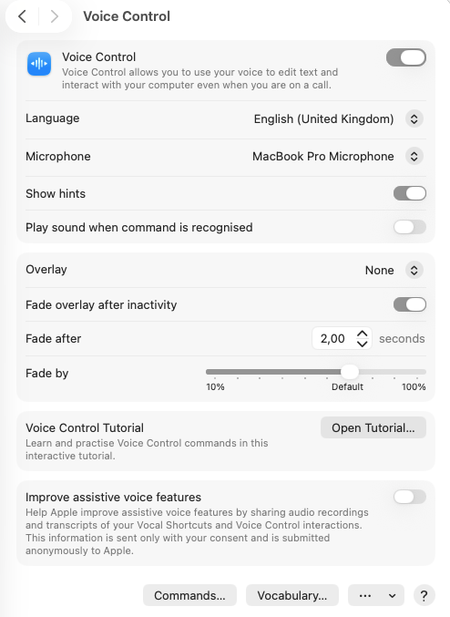
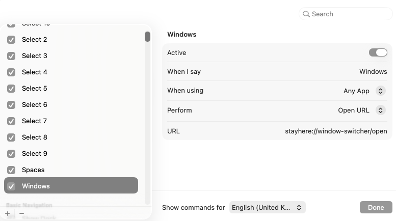
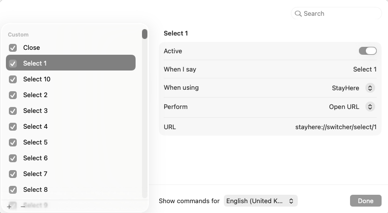

# Voice Control

StayHere exposes a few automation URLs that you can use to control switchers through the built-in macOS Voice Control feature.

To make it work, you need to:

## Enable Voice Control in your settings

## Create open commands for switchers

## Create select commands

You will use these commands to pick spaces and apps from the switchers.

## Import custom commands

Custom commands can also be imported. Here is an example configuration:

[Voice Control Importable Config](examples/voice_control_commands_examples.voicecontrolcommands)

A demo of the whole configuration proces nad it's results, you can find here:

Click [here](https://www.youtube.com/watch?v=6cMmO0_Kdeg) to watch a demo of the configuration process and the result.

### Availabe automation URLs

- `stayhere://window-switcher/open`
- `stayhere://space-switcher/open`
- `stayhere://switcher/next`
- `stayhere://switcher/previous`
- `stayhere://switcher/commit`
- `stayhere://switcher/select/N`
- `stayhere://switcher/close`